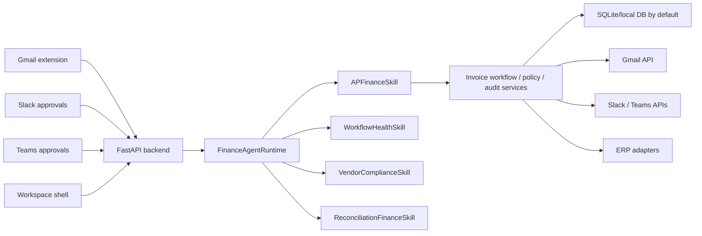
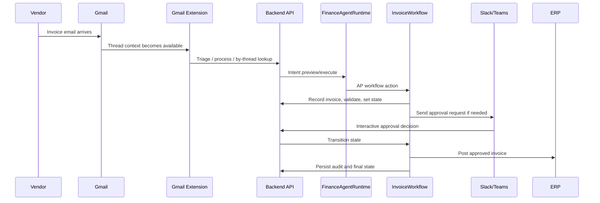

# Solden Architecture

This document describes the current architecture of Solden as implemented in this repository. It is deliberately grounded in the codebase, not just the product narrative.

The shortest correct description of Solden is:

- Solden is the **execution layer for finance operations**
- more specifically, it is a **Finance AI Agent** embedded in the tools finance teams already use
- it uses **one finance agent runtime**
- AP is the first production workflow and skill domain on that runtime
- its current wedge is **Gmail-first AP execution**
- Gmail is the primary operator surface, Slack and Teams are approval surfaces, and the ERP remains the system of record

This document covers:

- product and system boundaries
- the backend runtime model
- Gmail, Slack, Teams, workspace, and ERP surfaces
- the persistence and data model
- mailbox-centric Gmail orchestration
- AP workflow execution and state transitions
- policy, audit, readiness, and observability
- current implementation status versus partial or planned areas

## 1. Product Boundaries

Solden is not modeled here as:

- a generic AP dashboard
- an ERP replacement
- a broad finance suite
- an email client

It is modeled as:

- an AP execution layer that sits where invoice work already begins
- a Gmail-native operator workflow
- a shared record and workflow engine that coordinates approvals, follow-up, routing, and ERP posting

The core doctrine appears in:

- `README.md`
- `PLAN.md`
- `docs/EMBEDDED_ECOSYSTEM.md`
- `docs/HOW_IT_WORKS.md`
- `docs/AGENT_ARCHITECTURE.md`

The implementation follows that doctrine closely:

- Gmail thread and Gmail-native pages are the primary daily operator surface
- Slack and Teams are decision/approval surfaces
- ERP is authoritative for accounting system state
- backend orchestration is centralized in the finance runtime, not the UI

## 2. Architectural Principles

The current system consistently reflects these principles.

### 2.1 One runtime, multiple finance skills

The backend does not build separate orchestration systems per surface. It exposes one canonical runtime seam and dispatches to skill packages.

This seam is centered on:

- `clearledgr/core/finance_contracts.py`
- `clearledgr/services/finance_agent_runtime.py`
- `clearledgr/services/finance_skills/`

The runtime owns:

- intent routing
- skill registration
- skill manifests and readiness
- shared request and response contracts
- shared audit envelopes

### 2.2 Thin clients, thick backend

The UI surfaces are deliberately thin.

- Gmail extension: operator UI and route shell
- Slack and Teams: approval/interaction UIs
- workspace shell: setup, connections, policy, health, and operator utilities

The actual workflow logic stays in the backend:

- invoice routing
- policy checks
- approval logic
- audit generation
- ERP write-back decisions
- runtime readiness and autonomy rules

This is explicitly stated in `ui/README.md` and reflected across the APIs.

### 2.3 Server-enforced workflow

The system treats workflow transitions as backend-controlled, not UI-controlled. Surfaces can request actions, but the backend decides whether those actions are legal.

This shows up in:

- the AP workflow service
- deterministic validation and policy precheck
- legal actions and next-step responses
- audit logging

### 2.4 Embedded execution, not dashboard-first operation

The architecture is designed around embedded finance execution:

- Gmail for operator execution
- Slack/Teams for approval interaction
- ERP for final system-of-record state

That constraint matters because it shapes:

- the route surface
- the data model
- the mailbox orchestration model
- how policy and reminders are applied

## 3. High-Level Topology

The key design choice is that all surfaces converge on the backend runtime and service layer. The UI does not own its own source-of-truth workflow state.

## 4. Repository Shape

At a practical level, the repo is organized like this:

### 4.1 Application entrypoint

- `main.py`

This is the FastAPI application entrypoint. It assembles:

- middleware
- routers
- static mounts
- startup/lifespan behavior
- strict route-surface enforcement

### 4.2 API layer

- `clearledgr/api/`

This layer exposes surface-specific and domain-specific API routers, including:

- Gmail extension APIs
- Slack interactive APIs
- Teams interactive APIs
- workspace shell APIs
- agent intent APIs
- AP-specific APIs
- audit, policy, ops, and auth APIs

### 4.3 Service and runtime layer

- `clearledgr/services/`

This layer contains:

- finance runtime
- AP workflow orchestration
- skill implementations
- Gmail label and autopilot services
- policy compliance
- validation
- notifications
- background observers

### 4.4 Core and persistence

- `clearledgr/core/`

This layer contains:

- canonical runtime contracts
- persistence/database helpers
- stores
- resolution logic
- multi-surface record identity logic

### 4.5 UI surfaces

- `ui/gmail-extension/`
- `ui/slack/`

The Gmail extension is the primary operator-facing product surface. Slack is an approval/interaction surface. Teams is implemented through backend interactive routes rather than a separate top-level UI directory.

## 5. Backend Composition

## 5.1 FastAPI app and route surface

`main.py` assembles the application and enforces a deliberately narrow surface profile.

Important characteristics:

- the app is FastAPI-based
- it uses a lifespan hook for startup
- it includes a strict AP-v1 runtime surface profile
- it mounts `/static`
- it optionally serves `/workspace`

The application includes routers for:

- Gmail extension
- Slack invoice interactions
- Teams invoice interactions
- agent sessions
- agent intents
- AP items, audit, and policy
- Gmail webhooks
- workspace shell
- auth and ops

This strict surface is not cosmetic. A route-scope test enforces that the mounted route budget does not drift indefinitely.

### 5.2 Middleware

The middleware stack in `main.py` includes:

- security headers
- request logging
- rate limiting
- legacy surface guard
- workspace session CSRF protection
- correlation IDs

This means the architecture assumes:

- multiple surfaces and callbacks need consistent request tracing
- legacy or accidental route drift must be constrained
- workspace-authenticated flows must be explicitly guarded

### 5.3 Startup and deferred services

The app supports deferred startup and also supports `CLEARLEDGR_SKIP_DEFERRED_STARTUP=true` for local usage where immediate bind is more important than optional background startup work.

This is relevant because local Gmail-extension development often runs the backend directly and wants the API available immediately.

## 6. Canonical Runtime Model

The architecture revolves around a canonical finance runtime seam rather than a collection of ad hoc handlers.

### 6.1 Runtime contracts

`clearledgr/core/finance_contracts.py` defines the core runtime contracts:

- `SkillCapabilityManifest`
- `SkillRequest`
- `ActionExecution`
- `SkillResponse`
- `AuditEvent`

These are important because they standardize:

- how a unit of work is described
- how previews and executions are represented
- how readiness is exposed
- how audit events are emitted

This is the key mechanism that makes “one finance runtime, multiple finance skills” plausible instead of rhetorical.

### 6.2 FinanceAgentRuntime

`clearledgr/services/finance_agent_runtime.py` provides the tenant-scoped runtime.

Its responsibilities include:

- tenant scoping by `organization_id`
- actor scoping by `actor_id` and `actor_email`
- skill registration
- intent-to-skill dispatch
- skill listing and readiness summaries
- common helper methods reused across runtime execution

The runtime is explicitly tenant-scoped and user-scoped, but it does not encode UI-specific assumptions. That is what allows Gmail, Slack, Teams, and future surfaces to use the same backend execution model.

### 6.3 Current skill packages

The runtime currently registers these skill packages:

- `APFinanceSkill`
- `WorkflowHealthSkill`
- `VendorComplianceSkill`
- `ReconciliationFinanceSkill`

These live in:

- `clearledgr/services/finance_skills/ap_skill.py`
- `clearledgr/services/finance_skills/workflow_health_skill.py`
- `clearledgr/services/finance_skills/vendor_compliance_skill.py`
- `clearledgr/services/finance_skills/recon_skill.py`

Not every skill has the same product maturity, but the runtime seam treats them uniformly.

### 6.4 Agent intent API

The canonical intent API is exposed through `clearledgr/api/agent_intents.py`.

Current endpoints include:

- `GET /api/agent/intents/skills`
- `GET /api/agent/intents/skills/{skill_id}/readiness`
- `POST /api/agent/intents/preview`
- `POST /api/agent/intents/execute`
- `POST /api/agent/intents/preview-request`
- `POST /api/agent/intents/execute-request`

This API is the shared backend seam that thin surfaces can call without needing to duplicate logic.

## 7. Gmail-First Operator Surface

Gmail is the primary operator execution surface in the current product.

This is both product doctrine and implementation reality.

### 7.1 Why Gmail is central

The system assumes that AP work frequently begins where invoices first appear and where operators already live.

That leads to:

- Gmail thread as the current-record work surface
- Gmail-native extension views for queue and setup work
- backend logic optimized around email/thread identity

### 7.2 Gmail extension responsibilities

The Gmail extension is not the workflow engine. It is the operator-facing surface for:

- detecting invoice-related context
- showing invoice status and next steps
- rendering Gmail-native pages such as `Pipeline`, `Home`, `Review`, and `Upcoming`
- calling backend APIs to preview or execute actions

The actual build artifact used inside Gmail is:

- `ui/gmail-extension/build`

The source lives under:

- `ui/gmail-extension/src/`

### 7.3 Gmail extension backend surface

The Gmail extension’s backend surface is exposed from `clearledgr/api/gmail_extension.py` under `/extension`.

Representative endpoints include:

- triage and process actions
- scan
- pipeline and worklist views
- by-thread lookup and recovery
- approval and posting actions
- confidence verification
- bank and ERP matching
- escalation
- submit-for-approval
- reject-invoice
- budget decision
- approval nudge
- vendor follow-up
- retry recoverable failure
- finance summary share
- invoice status and workflow explain APIs
- field correction

This route surface shows that the Gmail extension is not just a passive sidebar. It is the primary operator application shell.

## 8. Slack and Teams as Approval Surfaces

Slack and Teams are integrated as interactive approval surfaces, not primary operator environments.

### 8.1 Slack

Slack interactions are exposed from:

- `clearledgr/api/slack_invoices.py`

The key route is:

- `POST /slack/invoices/interactive`

Slack is used for:

- approval prompts
- reminders and nudges
- decision capture
- approval state transitions tied back to the shared invoice record

### 8.2 Teams

Teams interactions are exposed from:

- `clearledgr/api/teams_invoices.py`

The key route is:

- `POST /teams/invoices/interactive`

Teams is architecturally parallel to Slack: it participates in approval capture, not primary operator execution.

### 8.3 Shared record, multiple surfaces

The important architecture point is that Slack and Teams do not own separate invoice records. They interact with the same AP record model that Gmail uses.

This shared-record model is the basis for:

- coherent audit trails
- approval state continuity
- unified workflow transitions

## 9. Workspace Shell

The workspace shell is the setup and administrative surface.

It is exposed from `clearledgr/api/workspace_shell.py` and serves:

- connection setup
- Gmail integration state
- mailbox management
- policy and settings updates
- workspace health and readiness

Historically, Gmail connectivity in this shell was presented as a singular integration. That is no longer fully true after the mailbox work described below.

## 10. Persistence Model

The codebase defaults to a local database model and supports truthful durability claims accordingly.

### 10.1 Database layer

`clearledgr/core/database.py` is the core schema and low-level persistence entrypoint.

Important schema families include:

- OAuth tokens
- Gmail autopilot state
- Gmail mailboxes
- Gmail mailbox state
- finance emails
- AP item sources
- invoice status and AP workflow data
- audit and policy-related tables

### 10.2 OAuth tokens

User-owned OAuth tokens are stored in:

- `oauth_tokens`

This matters because Gmail API access is still authenticated via user tokens, even though Gmail orchestration is no longer modeled as purely user-centric.

### 10.3 Finance email and source identity

The data model explicitly tracks email-originated finance records and AP sources. Two important details are now present in the schema:

- `finance_emails` has `mailbox_id` and `mailbox_email`
- `ap_item_sources` has `mailbox_id` and `mailbox_email`

This is critical for safe multi-mailbox operation. Without mailbox identity on record sources, multiple inboxes inside one workspace become hard to reason about.

### 10.4 Durability stack

The durable runtime is Celery + Redis Streams + Postgres task_runs (see §11.2 of AGENT_DESIGN_SPECIFICATION.md). Redis provides the durable event queue with consumer groups and exactly-once delivery. Postgres task_runs tracks per-step checkpointing for crash-resumable agent plans. Celery Beat fires time-based events (GRN polling, approval timeouts, override-window close, vendor chases).

## 11. Mailbox-Centric Gmail Orchestration

This is one of the most important architectural evolutions in the current codebase.

### 11.1 Problem the change solves

Originally, Gmail connectivity was effectively user-token-centric:

- tokens keyed by user
- autopilot state keyed by user
- workspace Gmail health effectively summarized one integration

That model is insufficient for real AP operations where a workspace may care about more than one Gmail inbox.

### 11.2 Current model

The current implementation introduces first-class mailbox resources while preserving user-owned OAuth tokens.

The model is now:

- user owns Gmail OAuth token
- workspace owns one or more Gmail mailbox resources
- mailbox state is tracked independently
- AP items and finance emails can carry mailbox identity

Key schema additions in `clearledgr/core/database.py`:

- `gmail_mailboxes`
- `gmail_mailbox_state`

Key fields include:

- `organization_id`
- `email`
- `display_name`
- `token_owner_user_id`
- `is_primary`
- `is_active`
- `settings_json`
- mailbox state such as `last_history_id`, `watch_expiration`, `last_scan_at`, `last_error`

### 11.3 Store layer

Mailbox orchestration is surfaced in `clearledgr/core/stores/integration_store.py`.

Important capabilities include:

- listing mailboxes per organization
- primary mailbox management
- activation/deactivation
- mailbox settings updates
- mailbox state reads and writes
- mailbox backfill/sync from existing Gmail tokens

This means mailbox orchestration is no longer a design note. It is part of the live persistence layer.

### 11.4 Workspace health

`clearledgr/api/workspace_shell.py` now computes Gmail status per organization by working from mailbox state rather than pretending Gmail is singular.

The Gmail status payload now includes:

- mailbox list
- connected/durable/reconnect summary
- active mailbox counts
- degraded mailbox counts
- watch and sync-related summary information

This is a real architectural change because it turns Gmail integration health into a set of mailbox resources rather than one flat integration object.

### 11.5 Autopilot

`clearledgr/services/gmail_autopilot.py` now processes mailboxes rather than directly treating raw user tokens as the unit of orchestration.

Important runtime facts visible in the code:

- mailbox syncing from tokens exists
- tokens are looked up through `token_owner_user_id`
- mailbox state persists `last_history_id` and `watch_expiration`
- the loop is mailbox-oriented

This means failures and watch state can be reasoned about per mailbox instead of only per user token.

### 11.6 Mailbox settings and defaults

Mailbox-level runtime defaults are now first-class settings.

Current defaults/policies include:

- `approval_channel_default`
- `slice_defaults`
- `entity_defaults`
- `label_scope`
- `policy_overrides`

These settings are not just stored. They are progressively being used at runtime for:

- approval routing fallbacks
- queue/upcoming navigation defaults
- entity routing
- Gmail label behavior
- mailbox-specific policy overlays

### 11.7 UI exposure

The Gmail extension `Connections` page now exposes mailbox-oriented settings, including:

- per-inbox defaults
- mailbox policy override controls
- explicit mailbox policy JSON
- inbox save flow

This means the mailbox model is now visible to operators/admins, not just hidden in backend code.

## 12. AP Record Identity and Resolution

One of the hardest parts of a multi-surface AP workflow is stable record resolution.

### 12.1 Shared record model

Solden uses a shared AP record model that can be resolved from:

- Gmail thread/message context
- Slack interaction context
- Teams interaction context
- AP item identifiers

This logic is centralized in:

- `clearledgr/core/ap_item_resolution.py`

### 12.2 Mailbox-aware resolution

The resolver now supports mailbox-aware lookups and also includes backward-compatible fallback paths for legacy DB adapters that do not yet accept mailbox-scoped arguments.

The resolver prefers mailbox-aware identity where available:

- `organization_id + mailbox_id + thread_id`
- `organization_id + mailbox_id + gmail_id`

but it can still fall back for legacy data or test seams.

This is important because it allows the platform to evolve toward safer multi-mailbox support without instantly invalidating older paths.

## 13. End-to-End AP Workflow

The product architecture makes the most sense when viewed as a workflow.

### 13.1 Intake

Invoices arrive through Gmail. The system creates or resolves finance-email and AP-item identity from Gmail context.

### 13.2 Validation and policy precheck

Before actions are taken, the backend performs deterministic checks:

- record validation
- policy compliance
- readiness gating where applicable

This prevents the UI from unilaterally mutating workflow state.

### 13.3 Thread becomes current-record workspace

The Gmail thread is the main record workspace for the current invoice:

- status
- approvals
- blockers
- next action
- context

### 13.4 Queue and control-plane views

The Gmail-native pages such as `Pipeline`, `Review`, and `Upcoming` act as control-plane views across many records.

### 13.5 Approval routing

If approval is required, the backend sends interactive approval requests to Slack or Teams and updates workflow state to pending approval.

### 13.6 Posting and completion

Once approved and valid, the invoice can be posted to ERP. Audit and state are then updated on the shared record.

## 14. Invoice Workflow Service and State Transitions

The AP workflow service is implemented in:

- `clearledgr/services/invoice_workflow.py`

This service owns the critical workflow transitions.

The file clearly handles:

- initial receipt and dedupe
- received state persistence
- needs-info and blocked outcomes
- pending approval transitions
- auto-approval paths
- Teams and Slack approval card emission
- posting logic and follow-up actions

Even without enumerating every transition exhaustively here, the implementation shows a server-enforced state machine rather than freeform status toggling from the UI.

The workflow service also coordinates:

- policy-based decisions
- reminder logic
- approval automation
- ERP-side follow-through

## 15. Policy, Validation, and Autonomy

The architecture separates policy and validation concerns rather than burying them inside UI handlers.

### 15.1 Deterministic policy enforcement

Policy evaluation is handled in services such as:

- `clearledgr/services/policy_compliance.py`
- `clearledgr/services/invoice_validation.py`

This allows the system to:

- reject illegal transitions
- block unsafe or incomplete actions
- require approvers
- reflect policy outcomes back into runtime responses

### 15.2 Mailbox-scoped policy overlays

Mailbox-level `policy_overrides` can now modify or extend organization-level policy behavior.

That means policy is no longer purely organization-global. It can be refined per mailbox when needed.

### 15.3 Autonomy and readiness

The runtime includes explicit readiness and autonomy support rather than implicit “AI magic”.

This includes:

- readiness summaries
- gate evaluation
- autonomy thresholds
- shadow proposal utilities
- post-action verification payloads

The architecture is therefore better described as controlled finance automation than as a freeform agent.

## 16. Audit and Observability

Auditability is built into the architecture, not bolted on.

### 16.1 Canonical audit event

`AuditEvent` in `finance_contracts.py` standardizes:

- actor
- entity
- action
- outcome
- correlation
- evidence references
- timestamp

### 16.2 Shared-record audit trail

The system assumes audit events should remain attached to the shared invoice record regardless of whether the action happened from Gmail, Slack, Teams, or backend automation.

### 16.3 Operational observability

The app also exposes:

- `/health`
- `/metrics`

and maintains mailbox/state fields such as:

- last scan
- watch expiration
- reconnect requirements
- last errors

This gives the system basic operational introspection even before considering external observability tooling.

## 17. Security, Tenancy, and Identity

### 17.1 Organization scoping

The runtime and store patterns consistently scope work by `organization_id`. This is the primary tenancy boundary in the codebase.

### 17.2 User identity

The runtime also keeps:

- `actor_id`
- `actor_email`

which means actions are attributable even when multiple surfaces call into the same backend.

### 17.3 Workspace auth and CSRF

The middleware stack includes workspace session CSRF protection. Auth and callback routes are treated as first-class architecture concerns, not as ad hoc exceptions.

### 17.4 OAuth ownership versus product ownership

One subtle but important distinction now exists:

- Gmail OAuth ownership is still user-based
- mailbox resource ownership is workspace/organization based

That distinction is one of the more important architectural refinements in the current codebase.

## 18. Build and Runtime Surfaces

### 18.1 Backend

The backend runs from `main.py` and serves:

- API routes
- static assets
- optional workspace shell

Local development often binds to `127.0.0.1:8010` for extension development.

### 18.2 Gmail extension build

The extension source lives under:

- `ui/gmail-extension/src`

The actual unpacked extension artifact used in Gmail is:

- `ui/gmail-extension/build`

This distinction matters because code changes in `src` are not the same thing as the live extension artifact until the extension is rebuilt.

### 18.3 Static workspace shell

Separately from the Gmail extension, the backend can serve a workspace shell under `/workspace` via static assets.

## 19. Testing and Guardrails

The repo contains real guardrails that shape the architecture, not just unit tests.

### 19.1 API and runtime tests

The backend test suite covers:

- Gmail webhooks
- Gmail autopilot
- API endpoints
- invoice workflow runtime transitions
- AP policy framework
- state observers
- record surfaces

### 19.2 Route-surface test

There is a route-surface scope test that limits the size of the allowed mounted path surface.

That is an architectural guardrail against silent surface sprawl.

### 19.3 Compatibility seams

Some tests rely on stable patch points such as:

- `FinanceAgentRuntime` being patchable in `agent_intents.py`
- `run_inline_gmail_triage` patchable in `gmail_triage_service` (used by the extension triage/process/scan endpoints)

That matters because the architecture has to stay testable even while internals evolve.

## 20. What Is Fully Implemented vs Partial

This section is important because the codebase contains both strong implemented areas and still-evolving parts.

### 20.1 Clearly implemented

The following are clearly implemented and central:

- FastAPI backend with strict route-surface profile
- canonical finance runtime and contracts
- AP as first production skill domain
- Gmail extension as primary operator surface
- Slack and Teams interactive approval surfaces
- server-enforced AP workflow transitions
- policy and validation services
- mailbox-centric Gmail orchestration primitives
- mailbox-aware AP source identity
- workspace mailbox settings and policy editor

### 20.2 Implemented but still maturing

These areas are real, but still evolving:

- richer mailbox-default consumption across all runtime paths
- mailbox-specific policy editing UX maturity
- reconciliation and non-AP skills compared with AP depth
- operational hardening around every compatibility seam

### 20.3 Not the same as “broad enterprise intake”

The current architecture does not mean Solden is already a broad enterprise AP intake platform for:

- EDI-first environments
- heavily portal-driven procurement flows
- tightly controlled enterprise intake stacks as the primary wedge

The current architecture can ingest and integrate beyond simple email-only flows, but the center of gravity remains Gmail-first AP execution.

## 21. The Most Important Architectural Decisions

If someone only remembers a few things about this codebase, they should remember these:

### 21.1 Finance runtime is the center

The system is not surface-first. Gmail, Slack, Teams, and workspace all sit around the finance runtime and service layer.

### 21.2 Gmail is the operator environment

The codebase is organized around Gmail as the primary execution surface for AP operators.

### 21.3 Shared record is the core abstraction

Approvals, thread actions, follow-up, and ERP posting all point back to the same AP record model.

### 21.4 Mailbox is now a first-class orchestration unit

This is one of the biggest architectural upgrades in the current system:

- user token for auth
- mailbox for orchestration
- organization for tenancy

### 21.5 Policy and audit are first-class

The system is designed for controlled workflow transitions, not uncontrolled AI actions.

## 22. Recommended Reading Order in the Repo

For a new engineer trying to understand the system, the best reading order is:

1. `README.md`
2. `PLAN.md`
3. `docs/EMBEDDED_ECOSYSTEM.md`
4. `docs/HOW_IT_WORKS.md`
5. `main.py`
6. `clearledgr/core/finance_contracts.py`
7. `clearledgr/services/finance_agent_runtime.py`
8. `clearledgr/services/invoice_workflow.py`
9. `clearledgr/api/gmail_extension.py`
10. `clearledgr/api/agent_intents.py`
11. `clearledgr/core/database.py`
12. `clearledgr/core/stores/integration_store.py`
13. `clearledgr/services/gmail_autopilot.py`
14. `clearledgr/core/ap_item_resolution.py`
15. `ui/gmail-extension/src/`

## 23. Summary

Solden’s current architecture is a finance execution architecture built around one finance runtime, shared record identity, server-enforced workflow transitions, and increasingly mailbox-aware orchestration.

Today, AP is the first and deepest production workflow on that architecture, with a Gmail-first execution model.

The cleanest architectural statement is:

- **surface layer:** Gmail, Slack, Teams, workspace
- **orchestration layer:** FastAPI APIs, finance runtime, workflow services, policy, audit
- **persistence layer:** local DB-centric state, mailbox state, AP records, audit records, token storage
- **integration layer:** Gmail API, Slack/Teams, ERP adapters

The codebase is strongest where it keeps those layers distinct.

It gets weaker whenever UI, auth ownership, mailbox ownership, and record identity are allowed to blur together. The recent mailbox work is important precisely because it sharpens those boundaries again.
